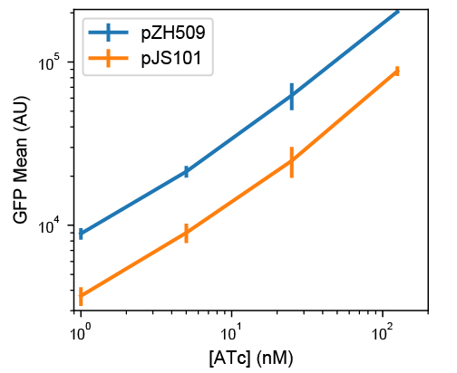
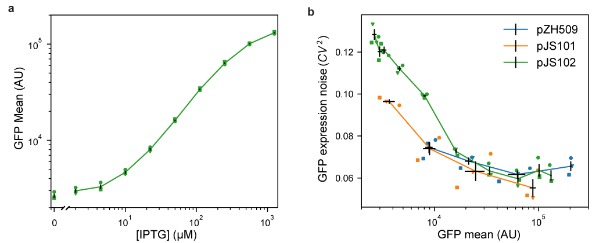

## Results 

### Moving bicistronic autoregulatory construct to a compatible plasmid backbone

The first step in creating a low-noise system for tuning expression of two genes is to establish that a previously characterized bicistronic autoregulatory circuit functions well in a compatible plasmid backbone. In this expression system, GFP and TetR are expressed bicistronically from the TetR-repressible promoter P~LtetO-1~ and expression is induced by the addition of ATc [@pmid:29084263]. This system was shown to have low noise and a linearized dose response compared to a system in which TetR is constitutively expressed. We moved the system from a plasmid with a p15A replicon conferring ampicillin resistance to a lower-copy-number plasmid with a pSC101 replicon conferring spectinomycin resistance [@pmid:6098521]. The p15A and pSC101 replicons have been used together in multiplasmid systems [@pmid:21933410].

[@pmid:29084263] my plosone paper
[@pmid:21933410] keasling biobricks

GFP expression mean and noise were characterized from low to high levels of induction by flow cytometry. Figure {@fig:pZH509-pJS101} shows that pJS101 induces at similar ATc concentrations as pZH509, with the change to the lower-copy pSC101 backbone resulting in a 58% drop in mean expression levels at a wide range of ATc concentrations. For a similar expression system in the absence of autoregulated TetR expression, moving the P~LtetO-1~ promoter from a p15A to a pSC101 backbone resulted in an 87% drop in expression [@pmid:9092630]. A smaller change is expected in our experiment since negative autoregulation will provide dosage compensation, just autoregulation can reduce noise in plasmid copy number [@pmid:16883354; @pmid:10850721; @pmid:14749823].

[@pmid:16883354] dublanche copy number variation
[@pmid:10850721] becskei serrano autoregulation noise
[@pmid:14749823] paulsson summing up the noise
[@pmid:9092630] lutz laco1 etc

{#fig:pZH509-pJS101}

### Alternative regulatory constructs with LacI replacing TetR

We hypothesized that replacing P~LtetO-1~ with the inducible promoter P~LlacO-1~  with similar characteristics [@pmid:9092630] and replacing TetR with LacI might result in a similarly useful expression system that could be tuned independently. However, regulatory parameters for TetR and LacI vary wildly, with ...

binding constants:
tetR:
LacI:

half induction:
TetR ATc Tc
LacI IPTG

Figure {@fig:pJS102-mean-noise} shows 

{#fig:pJS102-mean-noise}

### Using the new induction system for detection of single mRNA in living *E. coli*

blah blah

Figure {@fig:pZH713-optimization} shows 

{#fig:pZH713-optimization}

### Independent, tunable expression of two genes

Aggregation of mRNA-binding proteins from RNA bacteriophages makes it difficult to use fluorescent fusion proteins to detect single mRNAs [@doi:10.1038/nature09152]. We hypothesized that ...

[@doi:10.1038/nmeth.2413] mNeonGreen
[@doi:10.1038/nmeth.4074] mScarlet-I
[@doi:10.1093/emboj/16.9.2197] The Pf3 coat protein is a small membrane-spanning protein with a cytoplasm-facing C terminus.

Figure {@fig:pJS101-pDG101} shows 

{#fig:pJS101-pDG101}