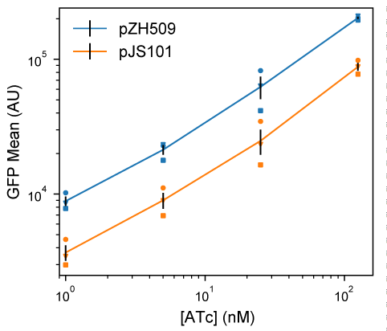

## Results 

### Moving bicistronic autoregulatory construct to a compatible plasmid backbone

The first step in creating a low-noise system for tuning expression of two genes is to establish that a previously characterized bicistronic autoregulatory circuit functions well in a compatible plasmid backbone. In this expression system, GFP and TetR are expressed bicistronically from the TetR-repressible promoter P~LtetO-1~ and expression is induced by the addition of ATc [@pmid:29084263]. This system was shown to have low noise and a linearized dose response compared to a system in which TetR is constitutively expressed. We moved the system from a plasmid with a p15A replicon conferring ampicillin resistance to a lower-copy-number plasmid with a pSC101 replicon conferring spectinomycin resistance [@pmid:6098521]. The p15A and pSC101 replicons have been used together in multiplasmid systems [@pmid:21933410].

GFP expression mean and noise were characterized from low to high levels of induction by flow cytometry. **Figure {@fig:pZH509-pJS101}** shows that pJS101 induces at similar ATc concentrations as pZH509, with the change to the lower-copy pSC101 backbone resulting in a 58% drop in mean expression levels at a wide range of ATc concentrations. For a similar expression system in the absence of autoregulated TetR expression, moving the P~LtetO-1~ promoter from a p15A to a pSC101 backbone resulted in an 87% drop in expression [@pmid:9092630]. A smaller change is expected in our experiment since negative autoregulation will provide dosage compensation, just autoregulation can reduce noise in plasmid copy number [@pmid:16883354; @pmid:10850721; @pmid:14749823].

{#fig:pZH509-pJS101 width=89mm}

### Alternative regulatory constructs with LacI replacing TetR

We hypothesized that replacing P~LtetO-1~ with the inducible promoter P~LlacO-1~,  with similar characteristics [@pmid:9092630], and replacing TetR with LacI might result in a similarly useful expression system that could be tuned independently. However, regulatory parameters for TetR and LacI vary significantly. TetR binds *tetO2* more strongly than LacI binds *lacO1* (approximately 0.5—1.0 kcal/mol difference in binding energy [@pmid:14764926; @pmid:2182324] for a single site, with 2 tandem sites in our constructs). And, TetR binds ATc much more strongly than LacI binds IPTG [@pmid:10978179; @pmid:16432263].

We first characterized induction of GFP expression in MG1655 cells harboring IPTG-inducible pJS102 by flow cytometry. **Figure {@fig:pJS102-mean-noise}a** shows an induction range of almost 2 orders of magnitude from 0 to 1250 µM IPTG, with very good reproducibility of induction levels in 3 independent experiments. Previous experiments with the TetR-based system showed a large jump in expression going from 0 nM to 0.5 nM ATc [@pmid:29084263]. This effect is not seen for pJS102, suggesting that switching from TetR:ATc to LacI:IPTG improves the dynamic range of achievable induction levels to a small extent.

{#fig:pJS102-mean-noise width=183mm}

Next, we compared noise in protein expression, with the concern that the *lac* operon present in the MG1655 host strain could lead to all-or-none expression at intermediate IPTG concentrations [@pmid:16590055]. However, **Figure {@fig:pJS102-mean-noise}b** shows low noise in GFP expression at all IPTG concentrations, with noise levels comparable to pZH509 and pJS102 at the same mean GFP levels. Note that apparently high noise at very low expression is partially due to measurement noise (see Methods), and, at any rate, is much lower than noise when expression is regulated by a constitutively expressed repressor [@pmid:29084263]. Here, we also note that noise for pJS101, with its lower-copy-number pSC101 replicon, is lower than that for pZH509 or pJS102 at similar expression levels. This suggests that incorporating this construct into the chromosome, where copy number is more tightly regulated, may lead to a further noise reduction.

### Using the new induction system for detection of single mRNA in living *E. coli*

blah blah

Note that MG1655 has the full *lac* operon, and that we have seen that the system works well in the presence and absence of the *lac* operon (MG1655/pJS102 vs ZHX99/pZH713)

**Figure {@fig:pZH713-optimization}** shows 

![**Using IPTG to tune expression of a fluorescent RNA-binding protein for single mRNA detection in different growth conditions.** (**a**) Induction of PP7cp-SYFP2 with 100 µM IPTG works well in rich media conditions to detect single mRNAs tagged with 24 tandem PP7 repeats, but has too high an expression level to see single mRNA spots above background in minimal media conditions. Scale bar 4 µm. (**b**) Using the pJS102 expression system, an optimal range of 10--20 µM IPTG is quickly identified for single mRNA detection in minimal media. Scale bar 2 µM.](images/Fig3_pZH713_optimization.png){#fig:pZH713-optimization width=89mm}

### Independent, tunable expression of two genes

Aggregation of mRNA-binding proteins from RNA bacteriophages makes it difficult to use fluorescent fusion proteins to detect single mRNAs [@doi:10.1038/nature09152]. We hypothesized that ...

[@doi:10.1038/nmeth.2413] mNeonGreen
[@doi:10.1038/nmeth.4074] mScarlet-I
[@doi:10.1093/emboj/16.9.2197] The Pf3 coat protein is a small membrane-spanning protein with a cytoplasm-facing C terminus.

**Figure {@fig:pJS101-pDG101}** shows 

{#fig:pJS101-pDG101 width=89mm}