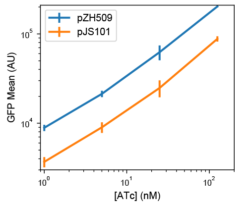

---
author-meta:
- "Jo\xE3o Silva"
- Soraia Lopes
- Diogo Grilo
- Zach Hensel
date-meta: '2019-01-04'
keywords:
- gene expression
- synthetic biology
- transcription
lang: en-US
title: Plasmids for independently tunable, low-noise gene expression
...

<small><em>
This manuscript
([permalink](https://zach-hensel.github.io/low-noise-manuscript/v/167464f189c7163f1df17fce9f83a859ed4cd7ff/))
was automatically generated
from [zach-hensel/low-noise-manuscript@167464f](https://github.com/zach-hensel/low-noise-manuscript/tree/167464f189c7163f1df17fce9f83a859ed4cd7ff)
on January 4, 2019.
</em></small>

## Authors

+ **João Silva** 
    {height="13px" width="13px"}
    [XXXX-XXXX-XXXX-XXXX](https://orcid.org/XXXX-XXXX-XXXX-XXXX) 
  <small>
     Instituto de Tecnologia Química e Biológica António Xavier, Universidade Nova de Lisboa, Oeiras, Portugal
  </small>

+ **Soraia Lopes** 
    {height="13px" width="13px"}
    [XXXX-XXXX-XXXX-XXXX](https://orcid.org/XXXX-XXXX-XXXX-XXXX) 
  <small>
     Instituto de Tecnologia Química e Biológica António Xavier, Universidade Nova de Lisboa, Oeiras, Portugal
  </small>

+ **Diogo Grilo** 
    {height="13px" width="13px"}
    [XXXX-XXXX-XXXX-XXXX](https://orcid.org/XXXX-XXXX-XXXX-XXXX) 
  <small>
     Instituto de Tecnologia Química e Biológica António Xavier, Universidade Nova de Lisboa, Oeiras, Portugal
  </small>

+ **Zach Hensel** 
    {height="13px" width="13px"}
    [0000-0002-4348-6229](https://orcid.org/0000-0002-4348-6229)
    · {height="13px" width="13px"}
    [zach-hensel](https://github.com/zach-hensel) 
  <small>
     Instituto de Tecnologia Química e Biológica António Xavier, Universidade Nova de Lisboa, Oeiras, Portugal
     · Funded by Project LISBOA-01-0145-FEDER-007660 (Microbiologia Molecular, Estrutural e Celular)
     Correspondence: [zach.hensel@itqb.unl.pt](mailto:zach.hensel@itqb.unl.pt)
  </small>

## Abstract {.page_break_before}

Some microbiology experiments and biotechnology applications can be improved if it is possible to tune the expression of two different genes at the same time with cell-to-cell variation at or below the level of genes constitutively expressed from the chromosome (the “extrinsic noise limit”). This was recently achieved for a single gene by exploiting negative autoregulation by the tetracycline repressor (TetR) and bicistronic gene expression to reduce gene expression noise. We report new plasmids that use the same principles to achieve simultaneous, low-noise expression for two genes. The TetR system was moved to a compatible plasmid backbone, and a system based on the lactose repressor (LacI) was found to also exhibit gene expression noise below the extrinsic noise limit. We characterize gene expression mean and noise across the range of induction levels for these plasmids, apply the LacI system to tune expression for single-molecule mRNA detection in two different growth conditions, and show that two plasmids can be co-transformed to independently tune expression of two different genes.

## Introduction {.page_break_before}

We recently reported the development of a plasmid-based gene-expression system in which a gene of interest is expressed bicistronically with the tetracycline repressor (TetR) [@TlAItren]. Using this gene expression system, cell-to-cell variation is below the “extrinsic noise limit” (coefficient of variation squared of protein concentration, $CV^2 \approx 0.1$) observed for genes expressed from the chromosome [@oD6kpSs3]. When TetR and GFP are expressed bicistronically, GFP induction and gene expression noise is similar to that observed for a TetR-GFP fusion protein with autoregulation [@x1Hd2npA]. Compared to induction of gene expression under the control of a constitutively expressed transcriptional repressor, the inducer dose-response is relatively linearized, and gene expression noise is much lower at intermediate induction levels [@TlAItren].

Our recent experiments in mRNA detection and other single-molecule experiments in living *E. coli* cells sometimes require the tunable expression of two different genes, both with low noise levels. For example, adopting a recently reported mRNA detection systems based on local enrichment of fluorescent RNA-binding proteins [@82diXnad] for use in *E. coli* requires lower noise in protein production relative to the same system in *S. cerevisiae*, because of a smaller cell volume and the inability to sequester unbound protein in the nucleus. At the same time, tunable expression with low noise in the level of the target RNA is desired to make it possible to characterize the accuracy of RNA detection over a range of RNA levels. We hoped that expressing both the target RNA and RNA-binding fluorescent protein on two plasmids that could be tuned independently would simplify and accelerate development of new RNA-detection systems in *E. coli*. Achieving this was a three-step process: first, characterizing the TetR-based system on a compatible plasmid backbone; second, establishing an orthogonal, low-noise expression system based on the *lac* repressor (LacI); and third, showing that the two systems can be tuned independently.

## Methods 

### Strain construction

All plasmids were constructed using isothermal assembly [@dc6GAnhL] of fragments generated by PCR or double stranded DNA synthesis (IDT, Coralville) and transformed Top10 E. coli cells (5-1600-020, IBA Life Sciences, Göttingen). Transformants were screened by colony PCR and verified by sequencing. Purified plasmids were transformed into *E. coli* strain MG1655 by growing 3 mL of culture in SOB media at 30 °C to an optical density at 600 nm (OD600) of 0.4, washing twice with 1 mL ice-cold water, resuspending in 40 µL water, electroporating 1—10 ng plasmid with the EC1 setting of a Micropulser (Bio-Rad Laboratories, Hercules), and recovering for 1 hour at 37 °C in SOC media before plating on selective LB-agar.

To generate pJS101 with a compatible backbone, plasmid pZH509 [@TlAItren] was used as a template to amplify the bicistronic regulatory construct including the P~LtetO-1~ promoter [@NCWOk1rp], GFPmut2 [@13TJF2gcl], tn10 TetR [@Q1a7tU8] and rrnB T1 transcription terminator [@xjKSoV9v]. This was assembled by isothermal assembly with the backbone from pGB2 [@5CRbRLYC] with the pSC101 origin of replication and spectinomycin resistance to generate plasmid pJS101. Plasmid pJS102 was generated by 3-fragment isothermal assembly. Plasmid pZH509 was used as a template both for the vector backbone and for GFPmut2, with non-homologous extensions added to PCR primers to generate the P~LlacO-1~ promoter [@NCWOk1rp]. LacI [@YoMCfbca] was amplified from *E. coli* MG1655 by colony PCR.

The test strain for mRNA imaging, ZHX99, was constructed similarly to ZHX222 in recent work [@A1kNMUKB]. In ZHX99 a construct in which a fusion protein of mVenus and Cro is expressed from the bacteriophage λ promoter *P~R~* was integrated into the chromosome to replace the *lac* operon in MG1655 [@RBKXt78E]. ZHX99 differs from ZHX222 in three ways. First, the *P~R~* promoter was weakened by site-directed mutagenesis to produce a strain with lower mRNA levels. Second, a very strong ribosome binding site was added (RBS #136 [@pzTydEMA]). Lastly, 24 tandem repeats of the recognition sequence for the PP7 coat protein (PP7cp) were inserted between the open reading frame and transcription terminator (amplified by PCR from pDZ251 [@1GFLV3s4q]). The pZH713 plasmid for mRNA detection was constructed by replacing GFPmut2 in pJS102 with a fusion protein of SYFP2 (amplified from a plasmid [@XuRR8Zmt]) and PP7cp (generated by codon optimization and DNA synthesis based on previously reported sequences [@EObeLKJ1]). Additionally, in pZH713 the PP7cp-SYFP2 fusion protein is translated from the weak ribosome binding site from pZH511 [@TlAItren]. We note that mVenus expression in ZHX99 is extremely low (undetectable without strong laser excitation) and does not interfere with mRNA detection by localizing up to 48 SYFP2 molecules in a diffraction-limited spot bound to a single mRNA molecule.

To test independent induction of two genes, GFPmut2 in pJS102 was replaced by mScarlet-I (amplified from a plasmid [@zj8Ydkzo]) to make pDG101. Plasmids were co-transformed into MG1655 by electroporation following the above protocol, except with 1 µL each undiluted plasmid (20—40 ng) and selecting on LB-agar plates with both spectinomycin and carbenicillin. Sequence maps are included in **File S2** and plasmids useful for constructing additional two-gene expression systems (pJS101 and pJS102, **Table {@tbl:plasmidList}**) are available from AddGene (deposit numbers 118280 and 118281) and have been verified by NGS [@q8xLcfYV].

| Plasmid | Ori | Promoter | GOI | Repressor Expression | Reference |
|----------|----------|----------|----------|----------|----------|
| pZH501 | p15a | CI-SNAP-tag | ~LtetO-1~ | bicistronic | [@TlAItren] |
| pZH509 | p15a | GFPmut2 |  P~LtetO-1~ | bicistronic | [@TlAItren] |
| pJS101 | pSC101 | GFPmut2 | P~LtetO-1~ | bicistronic | This work |
| pJS102 | p15a | GFPmut2 | P~LlacO-1~ | bicistronic | This work |
| pZH713 | p15a | PP7cp-SYFP2 | P~LlacO-1~  | bicistronic | This work |
| pDG101 | p15a | mScarlet-I | P~LlacO-1~  | bicistronic | This work |

Table: Plasmids used in this study. {#tbl:plasmidList}

### Characterization of GFP expression by flow cytometry

All flow cytometry experiment were repeated 3 times on different days and used plasmids transformed by electroporation into *E. coli* MG1655. Cultures were grown overnight at 30 °C from LB-agar plates supplemented with carbenicillin or spectinomycin (both at 50 $\mu /mL$) in 1 mL EZ Rich Defined Medium (M2105, Teknova, Hollister) supplemented with the same antibiotics. Cells were reinoculated 1:400 in 1 mL of the same media supplemented with Isopropyl β-D-1-thiogalactopyranoside (IPTG, at concentrations of 0, 2, 4.5, 10, 22.4, 50, 111.8, 250, 559, and 1250 µM) or anhydrotetrycline (ATc, at concentrations of 1, 5, 25, and 125 nM) as indicated and grown at 30 °C for 4—4.5 hours until reaching an optical density at 600 nm of 0.2—0.3. Next, 10 µL of cells were added to 1 mL of PBS at pH 7.4 and examined by flow cytometry.

Flow cytometry data was collected on an S3e cell sorter (Bio-Rad, Hercules) using a target flow rate of 2,000 counts/s and collecting 30,000 counts for each sample. A 488-nm laser line was used for excitation at its maximum power setting with amplification settings of 450 (forward scattering, FSC), 350 (side scattering, SSC), and 900 (FL1, 525/30 nm). The cell sorter is calibrated daily for a linear response to sample fluorescence intensity. Acquisition was triggered by forward scattering with a threshold of 3. Data was exported as an FCS file and imported into a custom Python script using FlowCal [@J6PWaBUu]. Following previous methods [@TlAItren], one third of samples were selected based on proximity to the peak of FSC-AREA and SSC-HEIGHT in a 2D histogram using the density2d method in FlowCal. The FL1-AREA measurements were used to estimate the mean and variance of GFP distributions for all samples. This was done by estimating the probability density functions in bins distributed equally in logarithmic space and fitting by least squares minimization to a gamma function. We found that this method reduced the influence of low-FL1-AREA events that escaped other gating steps, and which had frequencies that varied for different samples and days (**Figure {@fig:gammaFits}**). In all plots, the mean fluorescence of a strain harboring a similar plasmid, pZH501, that does not encode a fluorescent protein, was subtracted [@TlAItren].

We note that side scattering was weakly correlated with fluorescence, and thus with cell size, so this gating modestly reduces measured noise in FL1-AREA. However, we are comparing to an "extrinsic noise limit" determined from measurements of cell fluorescence divided by cell area [@oD6kpSs3], which effectively does the same thing. In practice, we observed slightly lower noise measurements for GFP concentration in fluorescence microscopy images compared to total GFP fluorescence in the gated flow cytometry sample for similarly induced strains. This difference was more significant for very-low-expression conditions, and noise in conditions where GFP fluorescence distributions significantly overlap with ungated background events (GFP intensity less than 10^4^ in **Figure {@fig:gammaFits}**) is somewhat overestimated. The script for data analysis as well as all raw FCS data is available in **File S2** and utilized modules from SciPy, NumPy, Matplotlib, and Pandas.

### Microscopy

For microscopy, cells were grown similarly to the protocol for flow cytometry, except that overnight cultures were diluted 1:100 and imaged after 2—4 hours of growth with induction. For mRNA imaging were that cells were grown in M9 media supplemented with 1X MEM Amino Acids (M9A) or M9A additionally supplemented with 1% SOB media. For 2-plasmid imaging, cells were grown in EZ Rich media. Cells were imaged on agarose gel pads (3% BP165-25, Fisher Bio-Reagents) diluted in M9A (for mRNA imaging) or PBS (for 2-plasmid imaging). For mRNA imaging, the microscope sample chamber was maintained at 30 °C. All imaging was done on a Leica DMI6000 inverted microscope using illumination from a Leica EL6000 source (at various intensities ensuring minimal photobleaching during acquisition), fluorescence filter cubes (Leica GFP ET, a custom filter set with Semrock filters FF01-561/13, FF02-616/73, and DI02-R561, or the Semrock LF514-B filter set), a 100x/1.46 a-plan apochromat oil immersion objective, and an Evolve 512 EM-CCD camera (Photometrics). Images were prepared using Fiji [@1Xy8hvPg], with linear scaling and maintaining minimum and maximum intensity values for all comparable images.

## Results 

### Moving bicistronic autoregulatory construct to a compatible plasmid backbone

The first step in creating a low-noise system for tuning expression of two genes is to establish that a previously characterized bicistronic autoregulatory circuit functions well in a compatible plasmid backbone. In this expression system, GFP and TetR are expressed bicistronically from the TetR-repressible promoter P~LtetO-1~ and expression is induced by the addition of ATc [@TlAItren]. This system was shown to have low noise and a linearized dose response compared to a system in which TetR is constitutively expressed. We moved the system from a plasmid with a p15A replicon conferring ampicillin resistance to a lower-copy-number plasmid with a pSC101 replicon conferring spectinomycin resistance [@5CRbRLYC]. The p15A and pSC101 replicons have been used together in multiplasmid systems [@15TQ1MvYV].

GFP expression mean and noise were characterized from low to high levels of induction by flow cytometry. **Figure {@fig:pZH509-pJS101}** shows that pJS101 induces at similar ATc concentrations as pZH509, with the change to the lower-copy pSC101 backbone resulting in a 58% drop in mean expression levels at a wide range of ATc concentrations. For a similar expression system in the absence of autoregulated TetR expression, moving the P~LtetO-1~ promoter from a p15A to a pSC101 backbone resulted in an 87% drop in expression [@NCWOk1rp]. A smaller change is expected in our experiment since negative autoregulation will provide dosage compensation, just autoregulation can reduce noise in plasmid copy number [@GcRoYBF2; @Qz6zNiXK; @S7KRThVS].

{#fig:pZH509-pJS101 width=89mm}

### Alternative regulatory constructs with LacI replacing TetR

We hypothesized that replacing P~LtetO-1~ with the inducible promoter P~LlacO-1~,  with similar characteristics [@NCWOk1rp], and replacing TetR with LacI might result in a similarly useful expression system that could be tuned independently. However, regulatory parameters for TetR and LacI vary significantly. TetR binds *tetO2* more strongly than LacI binds *lacO1* (approximately 0.5—1.0 kcal/mol difference in binding energy [@cpANz6cV; @UMSODjob] for a single site, with 2 tandem sites in our constructs). And, TetR binds ATc much more strongly than LacI binds IPTG [@Ls5d7x4o; @WxFVKQqb].

We first characterized induction of GFP expression in MG1655 cells harboring IPTG-inducible pJS102 by flow cytometry. **Figure {@fig:pJS102-mean-noise}a** shows an induction range of almost 2 orders of magnitude from 0 to 1250 µM IPTG, with very good reproducibility of induction levels in 3 independent experiments. Previous experiments with the TetR-based system showed a large jump in expression going from 0 nM to 0.5 nM ATc [@TlAItren]. This effect is not seen for pJS102, suggesting that switching from TetR:ATc to LacI:IPTG improves the dynamic range of achievable induction levels to a small extent.

{#fig:pJS102-mean-noise width=183mm}

Next, we compared noise in protein expression, with the concern that the *lac* operon present in the MG1655 host strain could lead to all-or-none expression at intermediate IPTG concentrations [@eUtnfAD6]. However, **Figure {@fig:pJS102-mean-noise}b** shows low noise in GFP expression at all IPTG concentrations, with noise levels comparable to pZH509 and pJS102 at the same mean GFP levels. Note that apparently high noise at very low expression is partially due to measurement noise (see Methods), and, at any rate, is much lower than noise when expression is regulated by a constitutively expressed repressor [@TlAItren]. Here, we also note that noise for pJS101, with its lower-copy-number pSC101 replicon, is lower than that for pZH509 or pJS102 at similar expression levels. This suggests that incorporating this construct into the chromosome, where copy number is more tightly regulated, may lead to a further noise reduction.

### Using the new induction system for detection of single mRNA in living *E. coli*

Recently, an improved method for detection of mRNA by local enrichment of fluorescent, RNA-binding proteins was reported in *S. cerevisiae* [@82diXnad]. This reduced the aggregation of mRNAs bound by the bacteriophage MS2 coat protein, which has also caused mRNA immortalization that has limited experiments in *E. coli* to observing transcription just after induction [@TvXapFFQ]. We hypothesized that aggregation could be reduced by reducing the expression levels of both mRNA and mRNA-binding proteins, and by having low cell-to-cell variation in expression. We developed a strain in which mRNA molecules encoding mVenus-Cro and also including 24 tandem repeats of the binding sequence for the PP7 coat protein (PP7cp) [@1GFLV3s4q] were constitutively expressed at low levels (less than 1 molecule per cell). Plasmid pJS102 was used as a template to develop a fluorescent, IPTG-inducible reporter of expression, PP7cp-SYFP2.

We tested the utility of this expression system for tuning low-noise gene expression in different growth conditions. In previous experiments, we expressed the RNA-binding protein from a constitutive promoter integrated into the chromosome; this required long cycles of optimization every time a parameter was changed (growth media, temperature, fluorescent protein sequence) that changed protein expression levels. **Figure {@fig:pZH713-optimization}a**  shows that single-molecule mRNA detection was optimal at 100 µM IPTG in partially rich media. We note the absence of pole-localized fluorescent spots that characterize mRNA aggregation [@uQeM79z], and that we observed reasonable mRNA lifetimes of a few minutes in timelapse imaging. We moved to minimal media hoping to find a growth condition with lower mRNA expression levels, but found that 100 µM IPTG gave a background of unbound PP7cp-SYFP2 molecules that often made it impossible to detect mRNA spots. **Figure {@fig:pZH713-optimization}b** shows how the IPTG-inducible expression system made it simple to quickly scan several different PP7cp-SYFP induction conditions and identify 10—20 µM IPTG as an optimal growth condition.

Lastly, we note that the strain used for mRNA imaging has its entire *lac* operon replaced by the synthetic construct. Thus, this expression system works well both in the presence and absence of the *lac* operon.

![**Using IPTG to tune expression of a fluorescent RNA-binding protein for single mRNA detection in different growth conditions.** (**a**) PP7cp-SYFP2 is induced with 100 µM IPTG to detect single mVenus-Cro mRNA molecules in supplemented media and minimal media conditions; in minimal media there is too high a PP7cp-SYFP expression level to see single mRNA spots above background. Scale bar 4 µm. (**b**) Using the pJS102 expression system, an optimal range of 10—20 µM IPTG is quickly identified for single mRNA detection in minimal media. Scale bar 2 µM.](images/Fig3_pZH713_optimization.png){#fig:pZH713-optimization width=89mm}

### Independent, tunable expression of two genes

Lastly, we tested whether ATc-inducible and IPTG-inducible plasmids could be combined to achieve low-noise expression of two genes into the same cell. We replaced GFPmut2 in pJS102 with the fast-maturing RFP mScarlet-I [@zj8Ydkzo] to create the plasmid pDG101. This plasmid was co-transformed with pJS101 into *E. coli* MG1655 and green and red fluorescence were compared at different combinations of ATc and IPTG concentrations. **Figure {@fig:pJS101-pDG101}a** shows that pJS101 induction by ATc was unaffected by pDG101 induction by IPTG, and that all conditions gave low noise in GFP concentration. **Figure {@fig:pJS101-pDG101}b** shows that mScarlet-I expression from pDG101 was similarly unaffected by the level of pJS101 induction by ATc. Thus, independent, tunable expression of two genes can be achieved by replacing GFPmut2 in pJS101 and pJS102 with other genes of interest and co-transforming the plasmids into *E. coli*.

{#fig:pJS101-pDG101 width=89mm}

## Discussion

We expect that the expression plasmids introduced here will be useful for diverse applications in molecular biology. Expression and purification of heteromeric protein complexes could be improved by stoichiometric production of their components, mimicking proportional synthesis in natural systems [@12aHdKu6v]. Additionally, low-noise expression can improve protein production yields [@5dC8qsZ9]. These systems could also be used in synthetic biology applications where yields can be improved by sequential induction of different components with low cell-to-cell variability. The capacity for low-noise expression at very low expression levels makes them particularly promising for single-molecule imaging experiments or for recombinant expression of low-copy-number components with low cell-to-cell variation to reproduce chromosomal expression levels.

Using modern molecular cloning techniques, it is simple to replace GFPmut2 in pJS101 and pJS102 with genes of interest. The apparent insensitivity of this circuit to regulatory parameters (DNA and inducer binding affinities) suggests that it can be easily extended to a third repressor-based expression system. Further, additional ribosome binding sites can be added to the bicistronic operon to express additional components.

## Author contributions

JS, DG and ZH designed experiments and performed experiments. JS, SL, DG, and ZH performed molecular cloning. ZH and JS analyzed data and wrote the paper. JS, SL, DG and ZH edited and approved the manuscript. ZH supervised the project.

## Acknowledgments

This work was financially supported by: Project LISBOA-01-0145-FEDER-007660 (Microbiologia Molecular, Estrutural e Celular) funded by FEDER funds through COMPETE2020—Programa Operacional Competitividade e Internacionalização (POCI), by national funds through FCT—Fundação para a Ciência e a Tecnologia, and through a joint research agreement with the Okinawa Institute of Science and Technology (OIST). This manuscript was composed and edited using Manubot [@1GGGHdsew].

## References {.page_break_before}

<!-- Explicitly insert bibliography here -->

## Supplementary Material {.page_break_before}

![**Reproducibility of low-noise expression in 3 independent experiments.** Probability densities for each flow cytometry sample were calculated by kernel density estimates for the negative control plasmid pZH501 (orange), ZH509 (blue), pJS101 (green), and pJS102 (red) with fluorescence levels monotonically increasing with concentration of ATc (1, 5, 25, 125 nM) or IPTG (0, 2, 4.5, 10, 22.5, 50, 111.8, 250, 559, 1250). Distributions were fit by least squares regression to a gamma function (black dashed lines) to estimate sample mean and variance while minimizing the influence of non-fluorescent background events, which varied in frequency for different days and samples. ](images/FigureS1_gammaFits.png){#fig:gammaFits tag="S1" width=89mm}

**Supplementary File S2**: Raw flow cytometry data, Python scripts required to reproduce Figures {@fig:pZH509-pJS101} and {@fig:pJS102-mean-noise}, DNA sequences, and explanatory text files are available as a compressed archive at Zenodo.